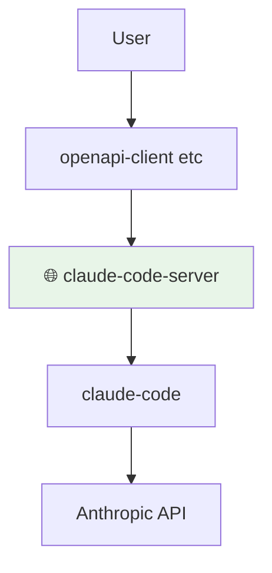
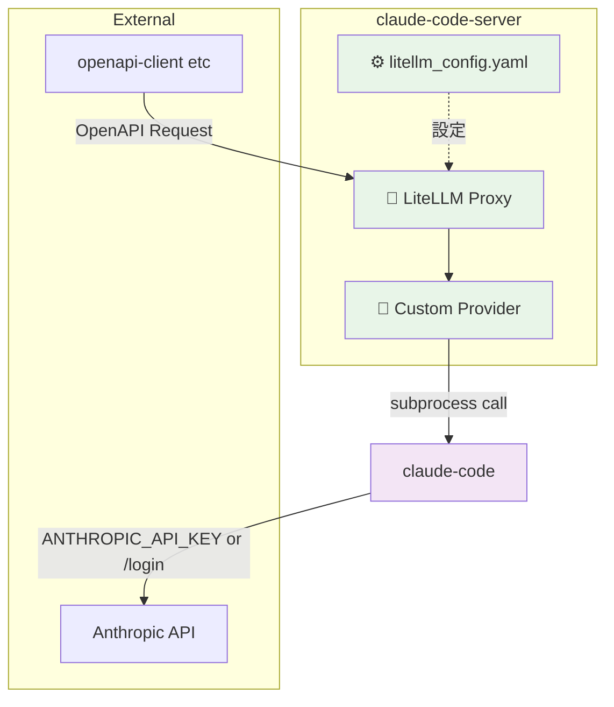

# claude-code-server

OpenAPI互換のLLM APIで、claude-codeをラップする薄いプロキシサーバーです。

## 構成

### C4 Model - システムコンテキスト図



### C4 Model - コンテナ図



- **LiteLLM**: OpenAPI互換のプロキシサーバーとして動作
- **Custom Provider**: claude-code CLIとの橋渡し役
- **claude-code CLI**: Anthropic APIと通信


## 使い方

### 前提条件

- Docker及びDocker Composeがインストールされていること
- Anthropic APIキーまたはclaude-codeアカウントでの認証が必要
- 開発環境では[Rye](https://rye.astral.sh/)がインストールされていること

### 起動方法

1. リポジトリをクローン
```bash
git clone https://github.com/suwa-sh/claude-code-server.git
cd claude-code-server
```

2. Dockerイメージをビルド
```bash
make docker-build
```

3. コンテナを起動
```bash
make docker-run
```

4. 認証設定（以下のいずれかの方法）

   **方法1: Anthropic APIキーを使用**
   ```bash
   # 環境変数を設定
   export ANTHROPIC_API_KEY=your-anthropic-api-key-here
   
   # コンテナを再起動
   make docker-down && make docker-run
   ```

   **方法2: Claudeアカウントでログイン**
   ```bash
   # インタラクティブログイン
   make docker-claude-login
   ```

5. APIエンドポイントにアクセス
```bash
curl http://localhost:4000/v1/chat/completions \
  -H "Content-Type: application/json" \
  -H "Authorization: Bearer sk-1234" \
  -d '{
    "model": "claude-sonnet-4",
    "messages": [
      {"role": "user", "content": "Hello, Claude!"}
    ]
  }'
```

### 環境変数

- `PORT`: APIサーバーのポート番号（デフォルト: 4000）
- `LITELLM_MASTER_KEY`: APIキー（デフォルト: sk-1234）
- `ANTHROPIC_API_KEY`: Anthropic APIキー（認証用）

### 注意事項

- このサーバーはclaude-codeのレート制限に従います
- ストリーミングレスポンスは現在サポートされていません
- プロダクション環境では必ずAPIキーを変更してください
- 初回起動時は認証が必要です。認証なしでAPIを呼び出すとエラーが返されます

### トラブルシューティング

**認証エラーが発生する場合:**
```bash
# エラー例：
# "claude-code authentication failed. Please set ANTHROPIC_API_KEY environment variable or run 'claude /login' to authenticate."

# 解決方法1: APIキーを設定
export ANTHROPIC_API_KEY=your-api-key
make docker-down && make docker-run

# 解決方法2: ログインコマンドを実行
make docker-claude-login
```

## 開発

### セットアップ

```bash
# Ryeのインストール (macOS/Linux)
curl -sSf https://rye.astral.sh/get | bash

# プロジェクトの初期化
make init  # または rye init

# 依存関係のインストール
make sync  # または rye sync
```

### テストの実行

```bash
# 全テストの実行
make test-all

# ユニットテストのみ
make test

# 統合テストのみ
make test-integration

# カバレッジレポート付き
make coverage
```

### OpenAIクライアントでのテスト

```python
from openai import OpenAI

client = OpenAI(
    api_key="sk-1234",
    base_url="http://localhost:4000/v1"
)

response = client.chat.completions.create(
    model="claude-sonnet-4",
    messages=[
        {"role": "user", "content": "Hello, Claude!"}
    ]
)

print(response.choices[0].message.content)
```

### CI/CD

- GitHub Actionsで自動テストが実行されます
- DockerイメージはGitHub Container Registryに自動プッシュされます
